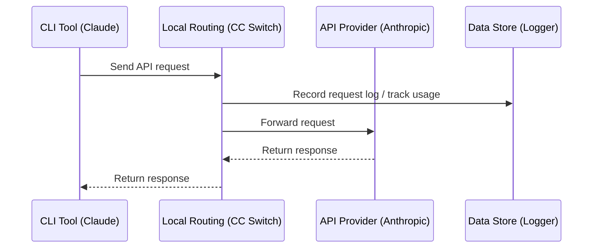

# 4.1 Local Routing Service

## Overview

Local routing starts an HTTP service on your machine. Once routing is enabled for an app, that app's API requests go to CC Switch first, and CC Switch forwards them to the current provider.

**Primary uses**:
- Format conversion: lets Claude Code use providers with OpenAI or Gemini formats, and lets Codex and Grok Build use providers with Chat Completions or Anthropic Messages formats
- Automatic failover: when a request to the current provider fails, switches to a backup provider according to the queue
- Hot switching: a provider switch takes effect immediately for subsequent requests
- Records the usage and status of every request

Apps that support local routing: **Claude Code**, **Codex**, **Gemini CLI**, **Grok Build**. Claude Desktop's "Model Mapping" mode is also forwarded through local routing; see [2.6 Claude Desktop](../2-providers/2.6-claude-desktop.md).

> 💡 You don't need local routing to track usage: with routing off, CC Switch also collects usage from each tool's local session logs. See [4.4 Usage Statistics](./4.4-usage.md).

## Start Local Routing

### Option 1: Settings Page

1. Open "Settings → Routing → Local Routing"
2. Turn on "Routing Master Switch" to start the local service
3. Under "Routing Enabled", turn on the apps you want to route (Claude / Codex / Gemini / Grok Build)


### Option 2: Main Interface Toggle

After you turn on "Show Routing Toggle on Main Page" in "Settings → Routing → Local Routing", a local routing toggle appears at the top of the Claude, Codex, Gemini and Grok Build pages (the Claude Desktop page has its own routing toggle; see [2.6 Claude Desktop](../2-providers/2.6-claude-desktop.md)).

This toggle only controls routing for the **current app**:
- Turning it on starts local routing automatically if it isn't running yet
- Turning it off only disables routing for the current app; when no other app still has routing on, local routing stops automatically

Toggle states:
- ⚪ White: routing is off for the current app
- 🟢 Green: the current app is being forwarded through local routing


## Routing Configuration

### Basic Configuration

| Setting | Description | Default |
|---------|-------------|---------|
| Listen Address | IP address local routing binds to | `127.0.0.1` |
| Listen Port | Port local routing listens on (1024–65535) | `15721` |
| Record Request Usage | Writes the usage and status of routed requests to the local statistics database | Enabled |

The listen address and port are only shown while local routing is stopped; the "Record Request Usage" toggle is shown while local routing is running. Retry count and timeouts are configured per app in "Settings → Routing → Auto Failover"; see [4.3 Failover](./4.3-failover.md).

### Modify Configuration

1. **Turn off "Routing Master Switch"** (local routing must be stopped before the address and port settings appear)
2. Modify the listen address or port
3. Click "Save"
4. Turn "Routing Master Switch" back on

### Listen Address Options

| Address | Description |
|---------|-------------|
| `127.0.0.1` | Only accessible from local machine (recommended) |
| `0.0.0.0` | Allow LAN access |

## Running Status

When local routing is running, the panel displays the following information:

### Service Address

```
http://127.0.0.1:15721
```

Click the "Copy" button to copy the address.

### Current Providers

Displays the currently used provider for each app:

```
Claude: PackyCode
Codex: AIGoCode
Gemini: Google Official
```

### Statistics

| Metric | Description |
|--------|-------------|
| Active Connections | Number of requests currently being processed |
| Total Requests | Total number of requests since startup |
| Success Rate | Percentage of successful requests (>90% green, ≤90% yellow) |
| Uptime | How long local routing has been running |

### Failover Queue

The panel displays the failover queue for each app:

```
Claude
├── 1. PackyCode      [In Use] ●
├── 2. AIGoCode                ●
└── 3. Backup Provider         ○

Codex
├── 1. AIGoCode       [In Use] ●
└── 2. Backup Provider         ●
```

Queue details:
- Numbers indicate priority order
- The "In Use" label indicates the provider currently in use
- Health badges show provider status:
  - 🟢 Green: Operational (0 consecutive failures)
  - 🟡 Yellow: Degraded (has failures but not circuit-broken)
  - 🔴 Red: Circuit Open (circuit breaker tripped, temporarily skipped; see [4.3 Failover](./4.3-failover.md#circuit-breaker-configuration) for thresholds)

## How It Works

### Request Flow



### Configuration Changes

After you start local routing and enable routing for an app, CC Switch points that app's request address at local routing:

**Claude**:
```json
{
  "env": {
    "ANTHROPIC_BASE_URL": "http://127.0.0.1:15721"
  }
}
```

**Codex**:
```toml
[model_providers.custom]   # section of the current provider
base_url = "http://127.0.0.1:15721/v1"
```

**Gemini**:
```
GOOGLE_GEMINI_BASE_URL=http://127.0.0.1:15721
```

**Grok Build**: the request address in `~/.grok/config.toml` points to `http://127.0.0.1:15721/grokbuild/v1`.

While routing is on, the API Key in the config file is replaced with a placeholder; the real Key is kept in CC Switch and injected by local routing when it forwards requests.

## Format Conversion

Local routing automatically converts requests and responses according to the provider's configured "Upstream Format", for both streaming and non-streaming requests.

**Claude Code / Claude Desktop side** (the client sends Anthropic Messages requests):

| Provider Upstream Format | Local Routing Behavior |
|--------------------------|------------------------|
| **Anthropic Messages** | Pass-through (no conversion) |
| **OpenAI Chat Completions** | Converts to OpenAI Chat format and responses back |
| **OpenAI Responses API** | Converts to OpenAI Responses format and responses back |
| **Gemini Native generateContent** | Converts to Gemini native format and responses back |

**Codex / Grok Build side** (the client sends OpenAI Responses requests):

| Provider Upstream Format | Local Routing Behavior |
|--------------------------|------------------------|
| **Responses (native)** | Pass-through (no conversion) |
| **Chat Completions** | Converts to Chat Completions format and responses back |
| **Anthropic Messages** | Converts to Anthropic Messages format and responses back |

The upstream format is configured per provider in the advanced options when adding or editing a provider; see [2.1 Add Provider → Upstream Format (Claude)](../2-providers/2.1-add.md#upstream-format-claude) and [Upstream Format and Model Mapping for Codex / Grok Build](../2-providers/2.1-add.md#upstream-format-and-model-mapping-for-codex--grok-build).

> **Note**: Format conversion requires local routing to be running with routing enabled for the corresponding app.

## Stop Local Routing

### Option 1: Settings Page

Turn off "Routing Master Switch" in "Settings → Routing → Local Routing".

### Option 2: Main Interface Toggle

Turn off the local routing toggle at the top of each app page (requires "Show Routing Toggle on Main Page" to be on). Once routing is off for every app, local routing stops automatically.

### Post-stop Processing

When local routing stops, CC Switch will:

1. Restore each app's configuration to its state before routing was enabled
2. Save request logs
3. Close all connections

## Request Logs

### Enable Recording

Turn on the "Record Request Usage" toggle in the local routing settings (on by default).

### Log Contents

Each request record includes:

| Field | Description |
|-------|-------------|
| Time | Request time |
| App | Claude / Codex / Gemini / Grok Build |
| Provider | Provider used |
| Model | Requested model |
| Tokens | Input/output token count |
| Latency | Request duration |
| Status | Success/failure |

### View Logs

View request logs in the "Settings → Usage Statistics" tab.

## FAQ

### Port Already in Use

Error message: `Address already in use`

Solution:
1. Change the port (anywhere from 1024 to 65535)
2. Or close the program occupying the port

### Local Routing Fails to Start

Check:
- Is the port occupied
- Are there sufficient permissions
- Is the firewall blocking it

### Request Timeout

Possible causes:
- Network issues
- Provider server issues
- Incorrect local routing configuration

Solutions:
- Check network connection
- Try accessing the provider API directly
- Check provider configuration
