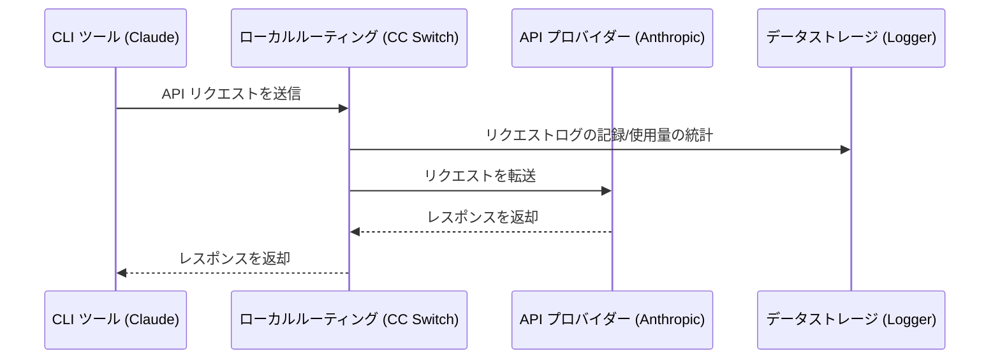

# 4.1 ローカルルーティングサービス

## 機能説明

ローカルルーティングは、ローカルマシン上で HTTP サービスを起動します。あるアプリでルーティングを有効にすると、そのアプリの API リクエストはまず CC Switch に送られ、CC Switch が現在のプロバイダーへ転送します。

**主な用途**：
- インターフェースフォーマットの変換：Claude Code で OpenAI や Gemini フォーマットのプロバイダーを、Codex や Grok Build で Chat Completions や Anthropic Messages フォーマットのプロバイダーを使えるようにする
- 自動フェイルオーバー：現在のプロバイダーへのリクエストが失敗すると、キューに従ってバックアッププロバイダーに切り替える
- ホットスイッチ：プロバイダーを切り替えると、以降のリクエストに即座に反映される
- 各リクエストの使用量と状態を記録

ローカルルーティングに対応するアプリ：**Claude Code**、**Codex**、**Gemini CLI**、**Grok Build**。Claude Desktop の「モデルマッピング」モードもローカルルーティング経由で転送されます。詳しくは [2.6 Claude Desktop](../2-providers/2.6-claude-desktop.md) を参照してください。

> 💡 使用量の統計にローカルルーティングは必須ではありません。ルーティングを有効にしていない場合も、CC Switch は各ツールのローカルのセッションログから使用量を集計します。詳しくは [4.4 使用量統計](./4.4-usage.md) を参照してください。

## ローカルルーティングの起動

### 方法 1：設定ページ

1. 「設定 → ルーティング → ローカルルーティング」を開く
2. 「ルーティング総スイッチ」をオンにして、ローカルサービスを起動
3. 「ルーティング有効」で、ルーティングするアプリ（Claude / Codex / Gemini / Grok Build）をオンにする


### 方法 2：メイン画面のスイッチ

「設定 → ルーティング → ローカルルーティング」で「メインページにルーティング切り替えを表示」をオンにすると、Claude、Codex、Gemini、Grok Build の各ページ上部にローカルルーティングのスイッチが表示されます（Claude Desktop のページには専用のルーティングスイッチがあります。[2.6 Claude Desktop](../2-providers/2.6-claude-desktop.md) を参照）。

このスイッチは**現在のアプリ**のルーティングだけを制御します：
- オンにしたとき、ローカルルーティングがまだ起動していなければ自動的に起動します
- オフにしたときは現在のアプリのルーティングだけを無効にします。ほかにルーティングが有効なアプリがなければ、ローカルルーティングは自動的に停止します

スイッチの状態：
- ⚪ 白：現在のアプリはルーティング無効
- 🟢 緑：現在のアプリはローカルルーティング経由で転送中


## ルーティング設定

### 基本設定

| 設定項目 | 説明 | デフォルト値 |
|--------|------|--------|
| リッスンアドレス | ローカルルーティングがバインドする IP アドレス | `127.0.0.1` |
| リッスンポート | ローカルルーティングがリッスンするポート（1024–65535） | `15721` |
| リクエスト使用量を記録 | ルーティングしたリクエストの使用量と状態をローカルの統計データベースに書き込む | オン |

リッスンアドレスとポートは、ローカルルーティングの停止中にのみ表示されます。「リクエスト使用量を記録」スイッチは、ローカルルーティングの実行中に表示されます。リトライ回数とタイムアウトは「設定 → ルーティング → 自動フェイルオーバー」でアプリごとに設定します。[4.3 フェイルオーバー](./4.3-failover.md) を参照してください。

### 設定の変更

1. **「ルーティング総スイッチ」をオフにする**（ローカルルーティングを先に停止しないと、アドレスとポートの設定は表示されません）
2. リッスンアドレスまたはポートを変更
3. 「保存」をクリック
4. 「ルーティング総スイッチ」を再びオンにする

### リッスンアドレスの説明

| アドレス | 説明 |
|------|------|
| `127.0.0.1` | ローカルマシンのみアクセス可能（推奨） |
| `0.0.0.0` | LAN からのアクセスを許可 |

## 実行状態

ローカルルーティングの実行中、パネルには以下の情報が表示されます：

### サービスアドレス

```
http://127.0.0.1:15721
```

「コピー」ボタンでアドレスをコピーできます。

### 現在のプロバイダー

各アプリが現在使用しているプロバイダーを表示：

```
Claude: PackyCode
Codex: AIGoCode
Gemini: Google 公式
```

### 統計データ

| 指標 | 説明 |
|------|------|
| アクティブ接続 | 現在処理中のリクエスト数 |
| 総リクエスト数 | 起動以来の総リクエスト数 |
| 成功率 | リクエスト成功の割合（>90% 緑、≤90% 黄） |
| 稼働時間 | ローカルルーティングの稼働時間 |

### フェイルオーバーキュー

パネルにはアプリごとにフェイルオーバーキューが表示されます：

```
Claude
├── 1. PackyCode      [使用中] ●
├── 2. AIGoCode                ●
└── 3. バックアップ              ○

Codex
├── 1. AIGoCode       [使用中] ●
└── 2. バックアップ              ●
```

キューの説明：
- 数字は優先順位を示す
- 「使用中」ラベルは現在使用しているプロバイダーを示す
- ヘルスバッジはプロバイダーの状態を示す：
  - 🟢 緑：正常（連続失敗 0 回）
  - 🟡 黄：低下（失敗はあるがサーキットブレーカー未発動）
  - 🔴 赤：サーキットオープン（サーキットブレーカーが発動し、一時的にスキップ中。閾値は [4.3 フェイルオーバー](./4.3-failover.md#サーキットブレーカーの設定) を参照）

## 動作原理

### リクエストフロー



### 設定の変更

ローカルルーティングを起動してアプリのルーティングを有効にすると、CC Switch はそのアプリのリクエスト先アドレスをローカルルーティングに書き換えます：

**Claude**：
```json
{
  "env": {
    "ANTHROPIC_BASE_URL": "http://127.0.0.1:15721"
  }
}
```

**Codex**：
```toml
[model_providers.custom]   # 現在のプロバイダーのセクション
base_url = "http://127.0.0.1:15721/v1"
```

**Gemini**：
```
GOOGLE_GEMINI_BASE_URL=http://127.0.0.1:15721
```

**Grok Build**：`~/.grok/config.toml` のリクエスト先アドレスが `http://127.0.0.1:15721/grokbuild/v1` を指すようになります。

ルーティングが有効な間、設定ファイル内の API Key はプレースホルダーに置き換えられます。実際の Key は CC Switch に保存され、ローカルルーティングが転送時に付与します。

## インターフェースフォーマット変換

ローカルルーティングは、プロバイダーに設定された「上流フォーマット」に従ってリクエストとレスポンスを自動的に変換します。ストリーミングと非ストリーミングの両方のリクエストに対応しています。

**Claude Code / Claude Desktop 側**（クライアントは Anthropic Messages リクエストを送信）：

| プロバイダーの上流フォーマット | ローカルルーティングの動作 |
|------|------|
| **Anthropic Messages** | パススルー（変換なし） |
| **OpenAI Chat Completions** | OpenAI Chat フォーマットに変換し、レスポンスを逆変換 |
| **OpenAI Responses API** | OpenAI Responses フォーマットに変換し、レスポンスを逆変換 |
| **Gemini Native generateContent** | Gemini ネイティブフォーマットに変換し、レスポンスを逆変換 |

**Codex / Grok Build 側**（クライアントは OpenAI Responses リクエストを送信）：

| プロバイダーの上流フォーマット | ローカルルーティングの動作 |
|------|------|
| **Responses（ネイティブ）** | パススルー（変換なし） |
| **Chat Completions** | Chat Completions フォーマットに変換し、レスポンスを逆変換 |
| **Anthropic Messages** | Anthropic Messages フォーマットに変換し、レスポンスを逆変換 |

上流フォーマットは、プロバイダーの追加・編集時に高度なオプションでプロバイダーごとに設定します。詳しくは [2.1 プロバイダーの追加 → 上流フォーマット（Claude）](../2-providers/2.1-add.md#上流フォーマットclaude) と [Codex / Grok Build の上流フォーマットとモデルマッピング](../2-providers/2.1-add.md#codex--grok-build-の上流フォーマットとモデルマッピング) を参照してください。

> **注意**：フォーマット変換には、ローカルルーティングが実行中で、かつ対象アプリのルーティングが有効になっている必要があります。

## ローカルルーティングの停止

### 方法 1：設定ページ

「設定 → ルーティング → ローカルルーティング」で「ルーティング総スイッチ」をオフにします。

### 方法 2：メイン画面のスイッチ

各アプリのページ上部にあるローカルルーティングのスイッチをオフにします（「メインページにルーティング切り替えを表示」がオンになっている必要があります）。すべてのアプリのルーティングがオフになると、ローカルルーティングは自動的に停止します。

### 停止後の処理

ローカルルーティングの停止時、CC Switch は以下を実行します：

1. 各アプリの設定をルーティング有効化前の状態に復元
2. リクエストログを保存
3. すべての接続を閉じる

## リクエストログ

### 記録の有効化

ローカルルーティングの設定で「リクエスト使用量を記録」スイッチをオンにします（デフォルトはオン）。

### ログの内容

各リクエスト記録には以下が含まれます：

| フィールド | 説明 |
|------|------|
| 時間 | リクエスト時刻 |
| アプリ | Claude / Codex / Gemini / Grok Build |
| プロバイダー | 使用されたプロバイダー |
| モデル | リクエストされたモデル |
| Token | 入力/出力の Token 数 |
| レイテンシ | リクエストにかかった時間 |
| ステータス | 成功/失敗 |

### ログの表示

「設定 → 利用統計」タブでリクエストログを表示できます。

## よくある質問

### ポートが使用中

エラーメッセージ：`Address already in use`

解決方法：
1. ポートを変更する（1024–65535 の範囲）
2. またはそのポートを使用しているプログラムを終了する

### ローカルルーティングの起動に失敗する

確認事項：
- ポートが使用中でないか
- 十分な権限があるか
- ファイアウォールがブロックしていないか

### リクエストがタイムアウトする

考えられる原因：
- ネットワークの問題
- プロバイダーのサーバーの問題
- ローカルルーティングの設定エラー

解決方法：
- ネットワーク接続を確認
- プロバイダーの API に直接アクセスを試みる
- プロバイダーの設定を確認
