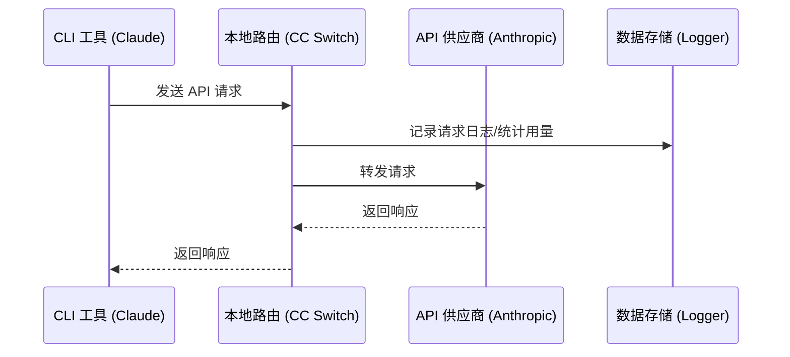

# 4.1 本地路由服务

## 功能说明

本地路由在本机启动一个 HTTP 服务。为某个应用开启路由后，该应用的 API 请求会先发到 CC Switch，再由 CC Switch 转发给当前供应商。

**主要用途**：
- 转换接口格式：让 Claude Code 使用 OpenAI 或 Gemini 格式的供应商，让 Codex、Grok Build 使用 Chat Completions 或 Anthropic Messages 格式的供应商
- 自动故障转移：当前供应商请求失败时，按队列切换到备用供应商
- 热切换：切换供应商后立即作用于后续请求
- 记录每次请求的用量与状态

支持本地路由的应用：**Claude Code**、**Codex**、**Gemini CLI**、**Grok Build**。Claude Desktop 的「模型映射」模式也经由本地路由转发，详见 [2.6 Claude Desktop](../2-providers/2.6-claude-desktop.md)。

> 💡 统计用量不一定要开启本地路由：不开路由时，CC Switch 也会从各工具的本地会话记录统计用量，详见 [4.4 用量统计](./4.4-usage.md)。

## 启动本地路由

### 方式一：设置页面

1. 打开「设置 → 路由 → 本地路由」
2. 打开「路由总开关」，启动本地服务
3. 在「路由启用」中打开要路由的应用（Claude / Codex / Gemini / Grok Build）


### 方式二：主界面开关

在「设置 → 路由 → 本地路由」中打开「在主页面显示本地路由开关」后，Claude、Codex、Gemini、Grok Build 页面顶部会出现本地路由开关（Claude Desktop 页面另有自己的路由开关，见 [2.6 Claude Desktop](../2-providers/2.6-claude-desktop.md)）。

这个开关只控制**当前应用**的路由：
- 打开时，如果本地路由还没运行，会自动启动
- 关闭时，只关闭当前应用的路由；没有其他应用还开着路由时，本地路由会自动停止

开关状态：
- ⚪ 白色：当前应用未开启路由
- 🟢 绿色：当前应用正在经本地路由转发


## 路由配置

### 基础配置

| 配置项 | 说明 | 默认值 |
|--------|------|--------|
| 监听地址 | 本地路由绑定的 IP 地址 | `127.0.0.1` |
| 监听端口 | 本地路由监听的端口（1024–65535） | `15721` |
| 记录请求用量 | 将路由请求的用量与状态写入本地统计数据库 | 开启 |

监听地址和端口只在本地路由停止时显示；「记录请求用量」开关在本地路由运行时显示。重试次数和超时时间在「设置 → 路由 → 自动故障转移」中按应用配置，见 [4.3 故障转移](./4.3-failover.md)。

### 修改配置

1. **关闭「路由总开关」**（必须先停止本地路由，才能看到地址和端口设置）
2. 修改监听地址或端口
3. 点击「保存」
4. 重新打开「路由总开关」

### 监听地址说明

| 地址 | 说明 |
|------|------|
| `127.0.0.1` | 仅本机可访问（推荐） |
| `0.0.0.0` | 允许局域网访问 |

## 运行状态

本地路由运行时，面板显示以下信息：

### 服务地址

```
http://127.0.0.1:15721
```

点击「复制」按钮可复制地址。

### 当前供应商

显示各应用当前使用的供应商：

```
Claude: PackyCode
Codex: AIGoCode
Gemini: Google 官方
```

### 统计数据

| 指标 | 说明 |
|------|------|
| 活跃连接 | 当前正在处理的请求数 |
| 总请求数 | 启动以来的总请求数 |
| 成功率 | 请求成功的百分比（>90% 绿色，≤90% 黄色） |
| 运行时间 | 本地路由已运行的时长 |

### 故障转移队列

面板会按应用显示故障转移队列：

```
Claude
├── 1. PackyCode      [使用中]   ●
├── 2. AIGoCode                  ●
└── 3. 备用供应商                 ○

Codex
├── 1. AIGoCode       [使用中]   ●
└── 2. 备用供应商                 ●
```

队列说明：
- 数字表示优先级顺序
- 「使用中」标签表示正在使用的供应商
- 健康徽章显示供应商状态：
  - 🟢 绿色：正常（连续失败 0 次）
  - 🟡 黄色：降级（有失败但未熔断）
  - 🔴 红色：熔断（已触发熔断，暂时跳过；阈值见 [4.3 故障转移](./4.3-failover.md#熔断器配置)）

## 工作原理

### 请求流程



### 配置修改

启动本地路由并为应用开启路由后，CC Switch 会把该应用的请求地址改为本地路由：

**Claude**：
```json
{
  "env": {
    "ANTHROPIC_BASE_URL": "http://127.0.0.1:15721"
  }
}
```

**Codex**：
```toml
[model_providers.custom]   # 当前供应商的配置段
base_url = "http://127.0.0.1:15721/v1"
```

**Gemini**：
```
GOOGLE_GEMINI_BASE_URL=http://127.0.0.1:15721
```

**Grok Build**：`~/.grok/config.toml` 中的请求地址指向 `http://127.0.0.1:15721/grokbuild/v1`。

开启路由期间，配置文件中的 API Key 会被替换为占位符，真实 Key 保存在 CC Switch 中，由本地路由在转发时注入。

## 接口格式转换

本地路由会按供应商配置的「上游格式」自动转换请求和响应，同时支持流式和非流式请求。

**Claude Code / Claude Desktop 侧**（客户端发出 Anthropic Messages 请求）：

| 供应商上游格式 | 本地路由行为 |
|-----------------|----------|
| **Anthropic Messages** | 透传（不转换） |
| **OpenAI Chat Completions** | 转换为 OpenAI Chat 格式，响应反向转换 |
| **OpenAI Responses API** | 转换为 OpenAI Responses 格式，响应反向转换 |
| **Gemini Native generateContent** | 转换为 Gemini 原生格式，响应反向转换 |

**Codex / Grok Build 侧**（客户端发出 OpenAI Responses 请求）：

| 供应商上游格式 | 本地路由行为 |
|-----------------|----------|
| **Responses（原生）** | 透传（不转换） |
| **Chat Completions** | 转换为 Chat Completions 格式，响应反向转换 |
| **Anthropic Messages** | 转换为 Anthropic Messages 格式，响应反向转换 |

上游格式在添加或编辑供应商时于高级选项中按供应商配置，详见 [2.1 添加供应商 → 上游格式（Claude）](../2-providers/2.1-add.md#上游格式claude) 和 [Codex / Grok Build 的上游格式与模型映射](../2-providers/2.1-add.md#codex--grok-build-的上游格式与模型映射)。

> **注意**：格式转换需要本地路由运行，并为对应应用开启路由。

## 停止本地路由

### 方式一：设置页面

在「设置 → 路由 → 本地路由」中关闭「路由总开关」。

### 方式二：主界面开关

在各应用页面关闭顶部的本地路由开关（需已开启「在主页面显示本地路由开关」）。所有应用的路由都关闭后，本地路由会自动停止。

### 停止后的处理

停止本地路由时，CC Switch 会：

1. 恢复各应用的配置到开启路由前的状态
2. 保存请求日志
3. 关闭所有连接

## 请求日志

### 开启记录

在本地路由设置中开启「记录请求用量」开关（默认开启）。

### 日志内容

每条请求记录包含：

| 字段 | 说明 |
|------|------|
| 时间 | 请求时间 |
| 应用 | Claude / Codex / Gemini / Grok Build |
| 供应商 | 使用的供应商 |
| 模型 | 请求的模型 |
| Token | 输入/输出 token 数 |
| 延迟 | 请求耗时 |
| 状态 | 成功/失败 |

### 查看日志

在「设置 → 使用统计」Tab 中查看请求日志。

## 常见问题

### 端口被占用

错误信息：`Address already in use`

解决方法：
1. 更换端口（1024–65535 之间）
2. 或关闭占用端口的程序

### 本地路由启动失败

检查：
- 端口是否被占用
- 是否有足够权限
- 防火墙是否阻止

### 请求超时

可能原因：
- 网络问题
- 供应商服务器问题
- 本地路由配置错误

解决方法：
- 检查网络连接
- 尝试直接访问供应商 API
- 检查供应商配置
